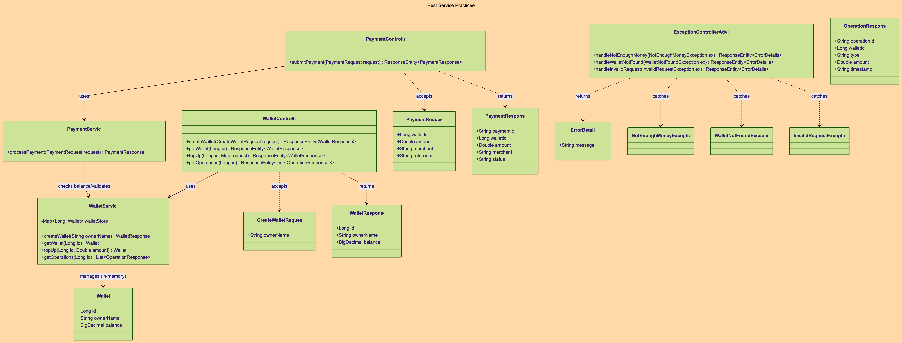

# WalletPay Project

I built a simple REST API for a wallet system called **WalletPay**. 

It can create wallets, add money (top-up), and handle payments. I also added global error handling and DTOs as we learned.

## How it's structured

## Quick Endpoints List:
- `POST /api/wallets` - Create wallet
- `GET /api/wallets/{id}` - Get wallet
- `POST /api/wallets/{id}/top-up` - Add money
- `POST /api/payments` - Pay someone
- `GET /api/wallets/{id}/operations` - See history

